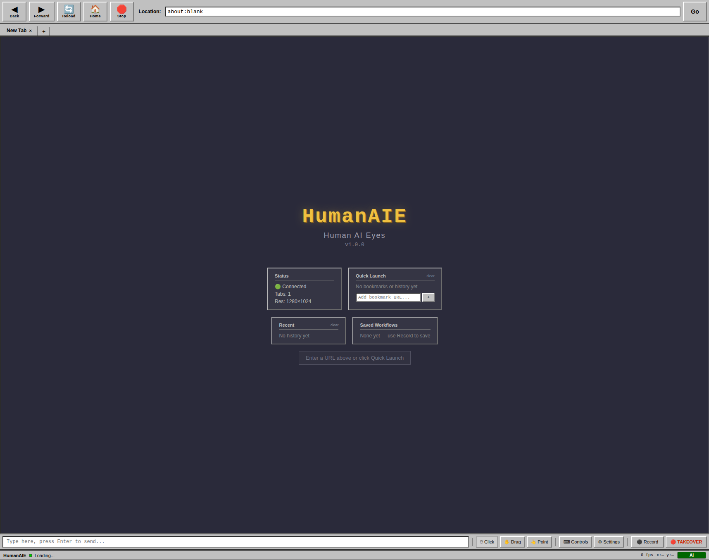

# HumanAIE

**Human AI Eyes** (pronounced "Human Eye") — a shared browser for human-AI collaboration.

<!-- badges -->


---

## What is this

AI browser tools are invisible. The agent navigates a headless browser you can't see, gets stuck on a captcha, and sits there burning tokens until it times out. There's no way to watch what it's doing, no way to help, and definitely no way to teach it where to click next time.

HumanAIE fixes that. It runs a headless Chromium instance and streams the viewport to a retro Netscape Navigator-themed UI in your browser. You watch the AI work in real-time. When it hits a captcha or can't find a button, it pings you -- notification chime, browser notification, yellow banner. You click through the captcha, the AI reads the coordinates and keeps going. No copy-pasting screenshots, no back-and-forth describing what's on screen.

The highlight-to-teach system is what makes this different from everything else out there. You highlight an element on the page, and HumanAIE logs those coordinates tied to the URL and a label. Next time the AI visits that page, it already knows where the login button is. You're building a spatial memory for your agent just by clicking.



---

## Quick Start

```bash
git clone https://github.com/datboip/HumanAIE.git
cd HumanAIE
npm install && npx playwright install chromium
npm start
```

Open [http://localhost:3333/cam/](http://localhost:3333/cam/) and you're live.

## Docker

```bash
docker build -t humanaie .
docker run -p 3333:3333 humanaie
```

## Install Script

One-liner for fresh machines:

```bash
curl -fsSL https://raw.githubusercontent.com/datboip/HumanAIE/main/install.sh | bash
```

---

## How It Works

```
AI Agent <--> REST API <--> HumanAIE Server <--> Headless Browser
                                   |
                             Cam UI (you watch here)
                                   |
                          Highlight --> AI learns coordinates
```

1. HumanAIE starts a headless Chromium and an Express server on port 3333
2. AI agent controls the browser via REST API (navigate, click, type, scroll)
3. You watch at `/cam/` -- real-time MJPEG stream or frame polling
4. When the AI gets stuck, it calls `/waitfor-highlight` and you get a notification
5. You click/highlight what it needs, the AI reads the coordinates and continues
6. Highlights are logged per-URL so the AI remembers for next time

---

## Features

**Browser Controls**
- Back, forward, navigate to any URL
- Configurable viewport resolution

**AI Interaction**
- Click, scroll, type, key press at coordinates
- Hover, fill form fields
- Wait for selectors

**Highlight-to-Teach**
- Human highlights elements on the page
- Coordinates + label + URL stored automatically
- AI queries highlight history to find known elements
- Builds spatial memory over time -- genuinely new, no other tool has this

**Session Recording**
- Record browser sessions as MP4 video
- Download, rename, and trim recordings

**Notifications**
- Audio chime when AI needs help
- Browser push notifications
- Yellow banner overlay in the Cam UI

**Takeover / Release**
- Human takes full control of the browser
- Release back to AI when done
- Seamless handoff, no restart needed

**Tabs**
- Create, switch, close tabs
- Full tab list with active indicator

**History**
- Browsing history with timestamps
- Frequent sites quick-launch
- Clear history

**Streaming**
- MJPEG stream (`/stream`)
- Single frame JPEG (`/frame.jpg`)
- Screenshot PNG (`/screenshot`)
- SSE event stream (`/events`)

---

## API Reference

### Navigation

| Method | Endpoint | Body | Description |
|--------|----------|------|-------------|
| POST | `/navigate` | `{ "url": "https://..." }` | Navigate to URL |
| POST | `/back` | -- | Go back |
| POST | `/forward` | -- | Go forward |
| GET | `/refresh` | -- | Get current frame as screenshot JSON |

### Interaction

| Method | Endpoint | Body | Description |
|--------|----------|------|-------------|
| POST | `/live/click` | `{ "x": 100, "y": 200 }` | Click at coordinates |
| POST | `/live/type` | `{ "text": "hello" }` | Type text |
| POST | `/live/scroll` | `{ "direction": "down", "amount": 300 }` | Scroll by direction + amount |
| POST | `/live/key` | `{ "key": "Enter" }` | Press a key |
| POST | `/type` | `{ "text": "hello" }` | Type text (agent API) |
| POST | `/hover` | `{ "x": 100, "y": 200 }` | Hover at coordinates |
| POST | `/scroll` | `{ "deltaY": -300 }` | Scroll vertically (agent API) |
| POST | `/key` | `{ "key": "Enter" }` | Press key (agent API) |
| POST | `/fill` | `{ "selector": "#email", "value": "a@b.com" }` | Fill a form field |
| POST | `/wait` | `{ "selector": ".loaded" }` | Wait for selector |

### Streaming

| Method | Endpoint | Description |
|--------|----------|-------------|
| GET | `/frame.jpg` | Current frame as JPEG |
| GET | `/stream` | MJPEG stream |
| GET | `/screenshot` | Full-page PNG screenshot |
| GET | `/events` | SSE event stream (actions, status changes) |
| GET | `/live/status` | Current live status (banner text, cursor pos) |

### Tabs

| Method | Endpoint | Body | Description |
|--------|----------|------|-------------|
| GET | `/tabs` | -- | List all tabs |
| POST | `/tabs/new` | `{ "url": "https://..." }` | Open new tab |
| POST | `/tabs/switch` | `{ "id": 2 }` | Switch to tab |
| DELETE | `/tabs/:id` | -- | Close tab |

### Highlights

| Method | Endpoint | Body | Description |
|--------|----------|------|-------------|
| POST | `/highlight` | `{ "x", "y", "label", "url" }` | Save a highlight |
| GET | `/highlights` | -- | Get active highlights |
| DELETE | `/highlights` | -- | Clear highlights |
| GET | `/highlight-history` | `?url=...&label=...` | Search saved highlights by URL or label |

### Waitfor (Human Handoff)

| Method | Endpoint | Body | Description |
|--------|----------|------|-------------|
| POST | `/waitfor-highlight` | `{ "message": "Click the login button" }` | Ask human to highlight something |
| GET | `/waitfor-highlight/status` | -- | Poll for human response |
| POST | `/waitfor-highlight/done` | -- | Human submits highlight |

### Control

| Method | Endpoint | Body | Description |
|--------|----------|------|-------------|
| POST | `/takeover` | -- | Human takes browser control |
| POST | `/release` | -- | Release control back to AI |
| POST | `/resize` | `{ "width": 1280, "height": 720 }` | Resize viewport |
| GET | `/viewport-size` | -- | Get current viewport dimensions |

### History

| Method | Endpoint | Description |
|--------|----------|-------------|
| GET | `/history` | Browsing history |
| GET | `/history/frequent` | Most visited sites |
| DELETE | `/history` | Clear history |

### Session Recording

| Method | Endpoint | Description |
|--------|----------|-------------|
| POST | `/record/start` | Start recording frames |
| POST | `/record/stop` | Stop recording |
| GET | `/record/status` | Recording status |
| GET | `/sessions` | List recorded sessions |
| GET | `/sessions/:id/mp4` | Download session as MP4 |
| PATCH | `/sessions/:id/rename` | Rename a session |
| POST | `/sessions/:id/edit` | Edit session (trim, speed, crop) |
| DELETE | `/sessions/:id` | Delete a session recording |

### Other

| Method | Endpoint | Description |
|--------|----------|-------------|
| GET | `/version` | Server version info |

---

## AI Integration

Add this to your AI agent's system prompt or tool instructions:

```
You have access to a shared browser via HumanAIE at http://localhost:3333.

To browse the web:
1. POST /navigate with {"url": "https://example.com"}
2. GET /screenshot to see the page
3. POST /live/click with {"x": 100, "y": 200} to click
4. POST /type with {"text": "search query", "x": 300, "y": 150} to type

When you can't find an element or hit a captcha:
1. POST /waitfor-highlight with {"message": "Please click the submit button"}
2. Poll GET /waitfor-highlight/status until the human responds
3. Use the returned coordinates to continue

Check highlight history before asking the human:
- GET /highlight-history?url=https://example.com
- If coordinates exist for this URL, use them directly

The human can see everything you do in real-time at /cam/.
```

---

## Claude Code Plugin

Install as a Claude Code plugin:

```bash
cd ~/.claude/plugins
git clone https://github.com/datboip/HumanAIE.git humanaie
```

### Commands

| Command | Description |
|---------|-------------|
| `/browse <url>` | Open a URL in the shared browser |
| `/screenshot` | Take a screenshot of the current page |
| `/click <x> <y>` | Click at coordinates |
| `/ask-human <message>` | Ask the user to highlight something on the page |

The **Browser Control** skill auto-activates when you mention browsing, websites, signing up, captchas, or web research.

---

## Environment Variables

| Variable | Default | Description |
|----------|---------|-------------|
| `HUMANAIE_PORT` | `3333` | Server port |
| `HUMANAIE_DATA_DIR` | `.` (cwd) | Data directory for history, highlights, sessions |
| `HUMANAIE_USER` | (empty) | Basic auth username |
| `HUMANAIE_PASS` | (empty) | Basic auth password |

---

## Browser Compatibility

| Browser | Streaming | Notes |
|---------|-----------|-------|
| Chrome / Firefox | MJPEG | Native MJPEG support, smooth streaming |
| Brave | Frame polling | Brave blocks MJPEG, falls back to polling `/frame.jpg` |
| Safari | MJPEG | Works, occasionally needs a refresh |

The Cam UI auto-detects and picks the best method.

---

## Security

- **Basic auth** is available via `HUMANAIE_USER` / `HUMANAIE_PASS` env vars
- Localhost requests bypass auth (the AI agent is local)
- The `/stream` and `/events` SSE endpoints bypass auth to avoid browser credential prompts
- If running on a shared network, set auth credentials and consider a reverse proxy with TLS

---

## Contributing

1. Fork the repo
2. Create a branch (`git checkout -b my-feature`)
3. Make your changes
4. Test locally (`npm start`, open `/cam/`, try the API)
5. Open a PR

Keep it simple. No framework churn, no build steps. It's one `server.js` and a `public/` folder.

---

## License

MIT
