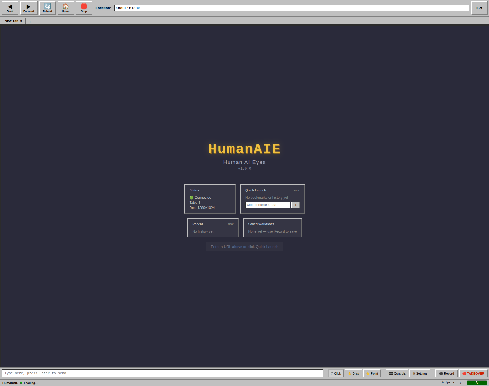

# HumanAIE

**Human AI Eyes** (pronounced "Human Eye") — a shared browser for human-AI collaboration.

<!-- badges -->


---

## What is this

AI browser tools are invisible. The agent navigates a headless browser you can't see, gets stuck on a captcha, and sits there burning tokens until it times out. There's no way to watch what it's doing, no way to help, and definitely no way to teach it where to click next time.

HumanAIE fixes that. It runs a headless Chromium instance and streams the viewport to a retro Netscape Navigator-themed UI in your browser. You watch the AI work in real-time. When it hits a captcha or can't find a button, it pings you -- notification chime, browser notification, yellow banner. You click through the captcha, the AI reads the coordinates and keeps going. No copy-pasting screenshots, no back-and-forth describing what's on screen.

The highlight-to-teach system is what makes this different from everything else out there. You highlight an element on the page, and HumanAIE logs those coordinates tied to the URL and a label. Next time the AI visits that page, it already knows where the login button is. You're building a spatial memory for your agent just by clicking.



---

## Quick Start

```bash
git clone https://github.com/datboip/HumanAIE.git
cd HumanAIE
npm install && npx playwright install chromium
npm start
```

Open [http://localhost:3333/cam/](http://localhost:3333/cam/) and you're live.

## Docker

```bash
docker build -t humanaie .
docker run -p 3333:3333 humanaie
```

## Install Script

One-liner for fresh machines:

```bash
curl -fsSL https://raw.githubusercontent.com/datboip/HumanAIE/main/install.sh | bash
```

---

## How It Works

```
AI Agent <--> REST API <--> HumanAIE Server <--> Headless Browser
                                   |
                             Cam UI (you watch here)
                                   |
                          Highlight --> AI learns coordinates
```

1. HumanAIE starts a headless Chromium and an Express server on port 3333
2. AI agent controls the browser via REST API (navigate, click, type, scroll)
3. You watch at `/cam/` -- real-time MJPEG stream or frame polling
4. When the AI gets stuck, it calls `/waitfor-highlight` and you get a notification
5. You click/highlight what it needs, the AI reads the coordinates and continues
6. Highlights are logged per-URL so the AI remembers for next time

---

## Features

**Browser Controls**
- Back, forward, navigate to any URL
- Configurable viewport resolution

**AI Interaction**
- Click, scroll, type, key press at coordinates
- Hover, fill form fields
- Wait for selectors

**Highlight-to-Teach**
- Human highlights elements on the page
- Coordinates + label + URL stored automatically
- AI queries highlight history to find known elements
- Builds spatial memory over time -- genuinely new, no other tool has this

**Session Recording**
- Record browser sessions as MP4 video
- Download, rename, and trim recordings

**Notifications**
- Audio chime when AI needs help
- Browser push notifications
- Yellow banner overlay in the Cam UI

**Takeover / Release**
- Human takes full control of the browser
- Release back to AI when done
- Seamless handoff, no restart needed

**Tabs**
- Create, switch, close tabs
- Full tab list with active indicator

**History**
- Browsing history with timestamps
- Frequent sites quick-launch
- Clear history

**Streaming**
- MJPEG stream (`/stream`)
- Single frame JPEG (`/frame.jpg`)
- Screenshot PNG (`/screenshot`)
- SSE event stream (`/events`)

**Android Device (HANDROID)**
- Drive a paired Android phone via the 📱 HANDROID tab (requires `adb` + USB or WiFi pairing)
- Live phone screen streamed via h264 (when supported) with screencap fallback
- Side-panel buttons: 🔓 unlock (wake + dismiss keyguard), ♻️ reboot (two-click safety), live FPS readout colored by health
- First tap on the viewport when screen is off wakes the phone — no banner overlay
- Viewport tap = phone tap; drag = swipe; hold-then-drag = drag-and-hold (rearrange icons)
- Visual drag overlay shows start point + direction + gesture type (green=swipe / orange=drag-hold)
- App launcher with favorites stored server-side (apps.json) — pick from phone's installed apps
- Splash screen surfaces live phone status (resolution, battery, foreground app) + quick-launch grid
- Real phone screen dims pulled from `wm size` so taps/swipes map correctly when stream is downscaled
- Watchdog: after 3 consecutive 5-min h264 backoff cycles, surfaces a "screenrecord wedged" banner with one-click reboot

**End-to-End Click Calibration (P3.1)**
- 📐 Calibrate button opens a target page on the phone (Chrome), fires 9 known taps, and the page reports actual touch coords back
- Drift shown live per dot; verdict ✅ accurate / ⚠ minor offset / ❌ misaligned with avg + max pixel error
- Built-in aim trainer mode: 8 random bullseyes, tap them in order, scored on accuracy + time + drift (same surface AI agents use to benchmark their own pipeline)

**Teaching Mode (P1 → P3 → P4)**
- Every `/android/tap` and `/android/swipe` auto-captures into a session (steps + per-step screenshots)
- Promote a successful session → named workflow tied to (package, activity)
- AI queries `/flows?intent=` to find a matching skill and replays its steps in one shot
- AI can `/propose` brand-new flows, `/flag` ones that drifted, `/propose-edit` precise step amendments
- Human approves/rejects in the 📂 Flows tab (per-app grouping, inline diff view for proposed edits)
- `/flows/catalog?package=` returns the AI a digest of all skills for an app sorted by flagged → success_rate → recency

---

## API Reference

### Navigation

| Method | Endpoint | Body | Description |
|--------|----------|------|-------------|
| POST | `/navigate` | `{ "url": "https://..." }` | Navigate to URL |
| POST | `/back` | -- | Go back |
| POST | `/forward` | -- | Go forward |
| GET | `/refresh` | -- | Get current frame as screenshot JSON |

### Interaction

| Method | Endpoint | Body | Description |
|--------|----------|------|-------------|
| POST | `/live/click` | `{ "x": 100, "y": 200 }` | Click at coordinates |
| POST | `/live/type` | `{ "text": "hello" }` | Type text |
| POST | `/live/scroll` | `{ "direction": "down", "amount": 300 }` | Scroll by direction + amount |
| POST | `/live/key` | `{ "key": "Enter" }` | Press a key |
| POST | `/type` | `{ "text": "hello" }` | Type text (agent API) |
| POST | `/hover` | `{ "x": 100, "y": 200 }` | Hover at coordinates |
| POST | `/scroll` | `{ "deltaY": -300 }` | Scroll vertically (agent API) |
| POST | `/key` | `{ "key": "Enter" }` | Press key (agent API) |
| POST | `/fill` | `{ "selector": "#email", "value": "a@b.com" }` | Fill a form field |
| POST | `/wait` | `{ "selector": ".loaded" }` | Wait for selector |

### Streaming

| Method | Endpoint | Description |
|--------|----------|-------------|
| GET | `/frame.jpg` | Current frame as JPEG |
| GET | `/stream` | MJPEG stream |
| GET | `/screenshot` | Full-page PNG screenshot |
| GET | `/events` | SSE event stream (actions, status changes) |
| GET | `/live/status` | Current live status (banner text, cursor pos) |

### Tabs

| Method | Endpoint | Body | Description |
|--------|----------|------|-------------|
| GET | `/tabs` | -- | List all tabs |
| POST | `/tabs/new` | `{ "url": "https://..." }` | Open new tab |
| POST | `/tabs/switch` | `{ "id": 2 }` | Switch to tab |
| DELETE | `/tabs/:id` | -- | Close tab |

### Highlights

| Method | Endpoint | Body | Description |
|--------|----------|------|-------------|
| POST | `/highlight` | `{ "x", "y", "label", "url" }` | Save a highlight |
| GET | `/highlights` | -- | Get active highlights |
| DELETE | `/highlights` | -- | Clear highlights |
| GET | `/highlight-history` | `?url=...&label=...` | Search saved highlights by URL or label |

### Waitfor (Human Handoff)

| Method | Endpoint | Body | Description |
|--------|----------|------|-------------|
| POST | `/waitfor-highlight` | `{ "message": "Click the login button" }` | Ask human to highlight something |
| GET | `/waitfor-highlight/status` | -- | Poll for human response |
| POST | `/waitfor-highlight/done` | -- | Human submits highlight |

### Control

| Method | Endpoint | Body | Description |
|--------|----------|------|-------------|
| POST | `/takeover` | -- | Human takes browser control |
| POST | `/release` | -- | Release control back to AI |
| POST | `/resize` | `{ "width": 1280, "height": 720 }` | Resize viewport |
| GET | `/viewport-size` | -- | Get current viewport dimensions |

### History

| Method | Endpoint | Description |
|--------|----------|-------------|
| GET | `/history` | Browsing history |
| GET | `/history/frequent` | Most visited sites |
| DELETE | `/history` | Clear history |

### Session Recording

| Method | Endpoint | Description |
|--------|----------|-------------|
| POST | `/record/start` | Start recording frames |
| POST | `/record/stop` | Stop recording |
| GET | `/record/status` | Recording status |
| GET | `/sessions` | List recorded sessions |
| GET | `/sessions/:id/mp4` | Download session as MP4 |
| PATCH | `/sessions/:id/rename` | Rename a session |
| POST | `/sessions/:id/edit` | Edit session (trim, speed, crop) |
| DELETE | `/sessions/:id` | Delete a session recording |

### Other

| Method | Endpoint | Description |
|--------|----------|-------------|
| GET | `/version` | Server version info |

### Android (Handroid)

Android endpoints are mounted when ADB is available on the server. Set `HUMANAIE_PHONE_IP` to your phone's WiFi-ADB address.

| Method | Endpoint | Body | Description |
|--------|----------|------|-------------|
| GET | `/android/screenshot` | -- | Current phone screen as PNG/JPEG |
| GET | `/android/stream` | -- | MJPEG stream (h264 piped through ffmpeg when available, screencap fallback) |
| GET | `/android/status` | -- | `{adb_available, phone_connected, package, activity, battery, screen_on, screen_w, screen_h}` |
| GET | `/android/info` | -- | Device model, Android version, serial |
| GET | `/android/ui-dump` | -- | `uiautomator` XML dump |
| POST | `/android/tap` | `{x, y}` | Tap at coordinates |
| POST | `/android/swipe` | `{x1, y1, x2, y2, dur}` | Swipe gesture (dur ≤ 300ms = fling; ≥ 1000ms = drag-and-hold) |
| POST | `/android/type` | `{text}` | Type text |
| POST | `/android/key` | `{keycode}` | Key event (KEYCODE_HOME, KEYCODE_BACK, etc.) |
| POST | `/android/wake` | -- | Wake phone + dismiss keyguard in one call (preferred over KEYCODE_WAKEUP) |
| POST | `/android/shell` | `{cmd}` | Arbitrary `adb shell` command |
| POST | `/android/launch` | `{pkg}` | Launch app by package name |
| GET | `/android/apps` | -- | List of favorited apps (read from server-side apps.json) |
| POST | `/android/apps` | `{pkg, name}` | Add an app to favorites |
| DELETE | `/android/apps/:pkg` | -- | Remove app from favorites |
| GET | `/android/apps/installed` | -- | All user-installed packages from `pm list packages -3` |
| POST | `/android/install` | `{apkPath}` | Install APK from local path |
| POST | `/android/push` | `{local, remote}` | Push file to device |
| POST | `/android/pull` | `{remote, local}` | Pull file from device |
| POST | `/android/record` | `{seconds}` | Record screen, returns MP4 path |
| POST | `/android/config` | `{captureIntervalMs}` | Tune screencap fallback cadence (16-2000ms) |
| POST | `/android/open-url` | `{url}` | Launch URL in phone's Chrome via ACTION_VIEW intent (whitelisted to http/https only) |
| POST | `/android/reboot` | -- | Reboot the phone (~30-45s offline; reconnect loop picks it back up) |
| POST | `/android/reconnect` | -- | Re-run `adb connect <PHONE_IP>` and refresh device state |

### Teaching Mode — Sessions + Workflows + Flows (P1 → P4)

Sessions are captured automatically from every `/android/tap` and `/android/swipe`.
Workflows are sessions promoted to a named, reusable skill keyed by `(package, activity)`.
"Flows" is the query layer AI agents use to discover and replay skills.

| Method | Endpoint | Body | Description |
|--------|----------|------|-------------|
| GET | `/teach/sessions` | `?package=&activity=` | List recent sessions (most recent first) |
| GET | `/teach/sessions/:id` | -- | Full session detail (steps + per-step screenshots) |
| POST | `/teach/done` | -- | Mark active session done (success); bumps replayed workflow's `success_count` |
| POST | `/teach/cancel` | -- | Discard active session |
| POST | `/teach/sessions/:id/promote` | `{name}` | Promote a human session to an `approved` workflow |
| POST | `/teach/sessions/:id/propose` | `{name, intent}` | AI auto-proposes a successful session as a `proposed` workflow |
| PATCH | `/teach/sessions/:id/steps` | `{steps}` | Edit captured steps (label, anchor) |
| GET | `/workflows` | `?package=&activity=&status=` | List workflows (status filter: `approved`/`proposed`/`rejected`/`proposed-edit`) |
| GET | `/workflows/:id` | -- | Single workflow detail |
| PATCH | `/workflows/:id` | `{name, ...}` | Edit workflow metadata |
| PATCH | `/workflows/:id/status` | `{status, rejected_reason?}` | Approve / reject / un-reject. On `proposed-edit`: approve merges into parent, reject deletes sibling |
| DELETE | `/workflows/:id` | -- | Delete workflow + on-disk files |
| POST | `/workflows/:id/flag` | `{reason}` | AI marks a flow as drifted (⚠ badge in UI) |
| POST | `/workflows/:id/unflag` | -- | Human clears flag |
| POST | `/workflows/:id/propose-edit` | `{steps, edit_reason}` | AI proposes an amended step array (sibling workflow). 409 if pending edit exists. |
| GET | `/flows` | `?package=&activity=&intent=&min_status=approved` | Fuzzy-match the best workflow for an intent. Returns `{workflow, confidence}` or null. Bumps `use_count` on hit. |
| GET | `/flows/catalog` | `?package=&activity=` | Per-app skill digest: counts + per-skill `{intent, success_rate, flagged, has_pending_edit}`. Sorted flagged-first → success_rate → recency. |

### Calibration (P3.1)

End-to-end click accuracy verification: the page reports actual touch coords back to the server so drift can be measured directly.

| Method | Endpoint | Body | Description |
|--------|----------|------|-------------|
| GET | `/calibrate-target` | -- | Mobile-optimized HTML page opened in phone's Chrome |
| POST | `/calibrate-target/report` | `{clientX, clientY, phoneX, phoneY, dpr, innerW, innerH, screenW, screenH, t}` | Page POSTs each touch back; broadcast via SSE as `CalibrationReport` |
| GET | `/calibrate-target/reports` | -- | Last 50 reports (ring buffer) |
| POST | `/calibrate-target/ready` | `{innerW, innerH, screenW, screenH, dpr, topOffsetCssPx, leftOffsetCssPx}` | Page fires this when ready (after fullscreen activates) |
| GET | `/calibrate-target/ready` | -- | `{ready_at, age_ms, dims}` — orchestrator polls this before firing taps |
| POST | `/calibrate-target/clear` | -- | Bump tick; page wipes accumulated dots |
| GET | `/calibrate-target/clear-tick` | -- | Page polls this to detect clear signal |
| POST | `/calibrate-target/aim-result` | `{N, hits, misses, totalSeconds, avgDriftPhonePx, details}` | Aim trainer submits final score; broadcast as `AimTrainer` SSE event |
| GET | `/calibrate-target/aim-result` | -- | Last aim trainer result |
| POST | `/calibrate/start` | -- | One-shot orchestrator (AI-callable): opens page on phone, fires 9 taps, returns `{captured, total, avg_err_px, max_err_px, verdict, pairs}` |

---

## AI Integration

Add this to your AI agent's system prompt or tool instructions:

```
You have access to a shared browser via HumanAIE at http://localhost:3333.

To browse the web:
1. POST /navigate with {"url": "https://example.com"}
2. GET /screenshot to see the page
3. POST /live/click with {"x": 100, "y": 200} to click
4. POST /live/click with {"x": 300, "y": 150} to focus a field, then POST /type with {"text": "search query"} to type

When you can't find an element or hit a captcha:
1. POST /waitfor-highlight with {"message": "Please click the submit button"}
2. Poll GET /waitfor-highlight/status until the human responds
3. Use the returned coordinates to continue

Check highlight history before asking the human:
- GET /highlight-history?url=https://example.com
- If coordinates exist for this URL, use them directly

The human can see everything you do in real-time at /cam/.
```

### Phone agent workflow (P3 — Teaching Mode replay)

AI agents driving the connected phone should consult approved flows before
exploring. The contract:

1. **Before starting a multi-step task, query for an approved flow:**

   ```
   GET /flows?package=com.instagram.android&intent=post%20a%20photo
   ```

   Returns `{ workflow, confidence }` if a match is found above the 0.4
   confidence threshold, or `{ workflow: null, reason }` otherwise.

2. **If a flow comes back, execute its steps in order:**

   ```
   POST /android/tap   { "x": 540, "y": 1200, "replay_of": "wf-..." }
   POST /android/swipe { "x1": 540, "y1": 1800, "x2": 540, "y2": 600, "dur": 250, "replay_of": "wf-..." }
   ```

   Pass `replay_of` in each request so the captured session links back to the
   source workflow. The server tracks `use_count` (attempts) and `success_count`
   (completed via `/teach/done`).

3. **On success, call `POST /teach/done`.** If you get stuck mid-replay, call
   `POST /waitfor-highlight` with a clear question; the human's resolution is
   captured as part of the session and you can resume.

4. **If no flow matched and you succeeded by exploring, propose your session
   as a new workflow:**

   ```
   POST /teach/sessions/:id/propose
   { "name": "Post a photo", "intent": "post a photo to instagram feed" }
   ```

   The proposed flow appears in the 🟡 Proposed column of the Flows tab. After
   the human clicks ✓ Approve, subsequent runs will pick it up via `/flows`.

5. **Cultural rule (not server-enforced):** if you've tried more than ~3 times
   to find an unknown UI element, stop spamming and call `/waitfor-highlight`
   instead. Burning tokens on retries when the human is one click away is the
   anti-pattern Teaching Mode is designed to eliminate.

### Click calibration (P3.1)

Before driving the phone, verify click accuracy with one call:

```
POST /calibrate/start
```

Returns:

```
{
  ok: true,
  captured: 9, total: 9,
  avg_err_px: 2.3, max_err_px: 4.1,
  verdict: "accurate",
  pairs: [{ target: {px,py}, observed: {x,y}, dx, dy, err }, ...]
}
```

Verdicts:

- **accurate** (avg err < 5px) — proceed with replay or exploration.
- **minor-offset** (avg err < 30px) — proceed, but expect occasional misses on
  small UI elements. Re-run if `/waitfor-highlight` fires for a target miss.
- **misaligned** (avg err ≥ 30px) — stop. Call `/waitfor-highlight` with a
  message like "Click drift exceeded 30px, check phone rotation or screen
  density." A human should verify before resuming.
- **incomplete** (< half the reports came back) — the calibration page didn't
  load (phone locked, Chrome not default browser, page got dismissed). Ask
  the human for help.

The orchestrator automatically opens `/calibrate-target` on the phone via ADB
intent, fires 9 taps in a 3×3 grid at 10/50/90% of the screen, and pairs each
fired tap with the touch reported by the page. Recommended call points:

- On first connect to a new phone.
- After a screen rotation event (landscape ↔ portrait).
- Any time `/waitfor-highlight` resolves with a "click missed target" reason.

### Skill discovery (P4)

Before exploring a new app, query the catalog:

```
GET /flows/catalog?package=com.instagram.android
```

Returns the full list of skills for that app (approved + flagged counts plus
per-skill metadata: intent, success_rate, use_count, has_pending_edit, flagged
status with reason). Scan this once at session start to know what skills are
available. Use `/flows` when you need to match a specific intent to a workflow.

Skills are sorted with flagged flows first (your attention items), then by
success_rate, then by recency.

### Flagging a degraded flow

If you replay a flow and it fails (a tap missed its target, a step landed on
unexpected content, you needed to call `/waitfor-highlight` mid-replay), flag
the flow so the human knows it drifted:

```
POST /workflows/wf-.../flag
{ "reason": "step 3 tap at (520, 1180) missed the post button — got 'home' instead" }
```

The flow keeps serving but gets a ⚠ badge in the UI. Do this BEFORE trying to
explore your way around the failure — the human seeing the flag is the trigger
for them to either fix the flow themselves or wait for you to propose an edit.

To clear a flag (after verifying the flow is healthy again):

```
POST /workflows/wf-.../unflag
```

### Proposing an edit

If you've identified what's wrong and have a fix, propose an edit instead of
asking the human to make it:

```
POST /workflows/wf-.../propose-edit
{
  "steps": [...amended step array...],
  "edit_reason": "step 3 coord moved from (520, 1180) to (540, 1200) after IG v210 UI change"
}
```

The edit lives as a sibling workflow with `status: "proposed-edit"`. The
original keeps serving until the human approves. After approval, the original's
steps are replaced in place (id, name, intent, use_count, success_count are all
preserved). Approval also auto-clears any flag on the parent.

Only one pending edit per parent — a second `/propose-edit` while one is
pending returns 409 with `pending_edit_id` pointing to the existing one. If
you need to revise your edit before the human reviews it, `DELETE /workflows/<pending_edit_id>`
first, then re-propose.

### Cultural rule (P4 amendment)

If you flag a flow more than 3 times for the same reason without proposing an
edit, you're failing the contract. Either propose an edit or call
`/waitfor-highlight` asking the human for the new coord. The point of
proposing edits is to keep the human's review queue short — flag-and-wait is
worse than propose-and-wait because the human has nothing concrete to act on.

---

## Claude Code Plugin

Install as a Claude Code plugin:

```bash
cd ~/.claude/plugins
git clone https://github.com/datboip/HumanAIE.git humanaie
```

### Commands

| Command | Description |
|---------|-------------|
| `/browse <url>` | Open a URL in the shared browser |
| `/screenshot` | Take a screenshot of the current page |
| `/click <x> <y>` | Click at coordinates |
| `/ask-human <message>` | Ask the user to highlight something on the page |

The **Browser Control** skill auto-activates when you mention browsing, websites, signing up, captchas, or web research.

---

## Environment Variables

| Variable | Default | Description |
|----------|---------|-------------|
| `HUMANAIE_PORT` | `3333` | Server port |
| `HUMANAIE_DATA_DIR` | `.` (cwd) | Data directory for history, highlights, sessions |
| `HUMANAIE_USER` | (empty) | Basic auth username |
| `HUMANAIE_PASS` | (empty) | Basic auth password |
| `HUMANAIE_PHONE_IP` | (empty) | Android phone IP for WiFi ADB (e.g., `192.168.1.42`) |
| `HUMANAIE_PHONE_PORT` | `5555` | Port for WiFi ADB |

---

## Browser Compatibility

| Browser | Streaming | Notes |
|---------|-----------|-------|
| Chrome / Firefox | MJPEG | Native MJPEG support, smooth streaming |
| Brave | Frame polling | Brave blocks MJPEG, falls back to polling `/frame.jpg` |
| Safari | MJPEG | Works, occasionally needs a refresh |

The Cam UI auto-detects and picks the best method.

---

## Security

- **Basic auth** is available via `HUMANAIE_USER` / `HUMANAIE_PASS` env vars
- Localhost requests bypass auth (the AI agent is local)
- The `/stream` and `/events` SSE endpoints bypass auth to avoid browser credential prompts
- If running on a shared network, set auth credentials and consider a reverse proxy with TLS

---

## Contributing

1. Fork the repo
2. Create a branch (`git checkout -b my-feature`)
3. Make your changes
4. Test locally (`npm start`, open `/cam/`, try the API)
5. Open a PR

Keep it simple. No framework churn, no build steps. It's one `server.js` and a `public/` folder.

---

## License

MIT
